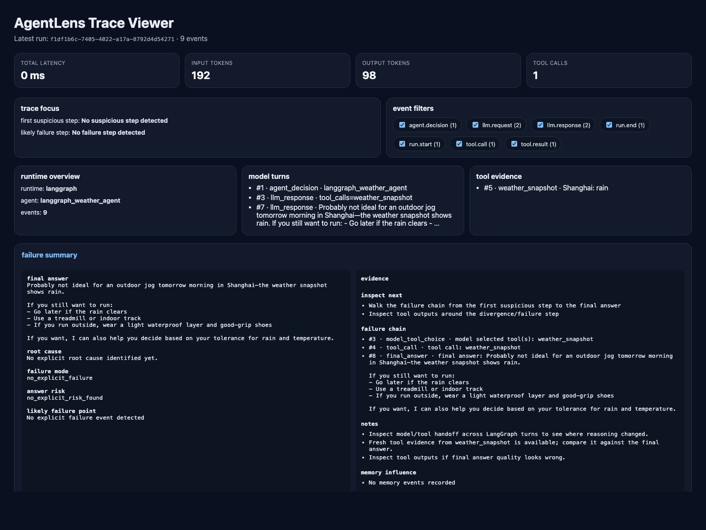

# AgentLens

**Explain why your agent failed.**

AgentLens is a **local-first debugger for LLM agents**.
It is built for the moment when a trace tells you what happened, but not **where the run actually started going wrong**.



The screenshot above is based on a real LangGraph-backed demo run traced by AgentLens:
- the model decides to call `weather_snapshot`
- the tool returns fresh evidence: `Shanghai: rain`
- the final answer updates to match the tool result

To refresh the README screenshot after generating a new trace:

```bash
./scripts/render_readme_screenshot.sh
```

That is the core product idea:
- **failure explanation** — where the run likely went wrong
- **tool and memory evidence** — what influenced the outcome
- **run divergence** — where run B started behaving differently from run A

Most tools help you log traces.
AgentLens is being built to help you answer the harder question:

> Why did this agent make the wrong decision?

## Demo Snapshot

The latest alpha can already trace a real LangGraph runtime and render it into a debugging view that surfaces:
- a debug priority score so you know which run to inspect first
- a debug inbox so recent runs can be triaged from highest-risk to lowest-risk in Markdown or HTML
- a baseline watch mode so regressions can jump to the top of the queue
- runtime overview
- a plain-language debug story for the run
- model turns
- tool evidence
- answer vs evidence review
- counterfactual hints for what to rerun or challenge first
- final answer
- failure chain and suspicious signals when they exist

To reproduce the LangGraph demo:

```bash
export OPENAI_API_KEY=...
export OPENAI_BASE_URL=https://your-openai-compatible-host/v1
export AGENTLENS_OPENAI_MODEL=gpt-5.2
python3 -m pip install -e ".[langgraph]"
python3 cli.py demo langgraph
python3 cli.py view
```

## Why AgentLens

Most LLM observability tools are good at showing traces.
Agent systems need more than traces — they need **failure explanation**.

Real agent failures are often caused by:

- tool output being misinterpreted
- recalled memory conflicting with fresh evidence
- the run diverging from a previously good trajectory
- the true failure starting earlier than the final bad answer

External signals point in the same direction:
- practitioners increasingly talk about **agent debugging** and **replayability** as missing layers
- recent work like Microsoft Research's **AgentRx** frames the problem as locating the **critical failure step** and the **root cause** in agent trajectories

AgentLens is built around that wedge: **explain where an agent run went wrong, and why.**

## Positioning

AgentLens is **not** trying to replace Langfuse, LangSmith, or Helicone head-on.

Instead, it starts with a sharper wedge:

- **agent runtime debugging**
- **memory observability**
- **run replay + regression diff**

## MVP

### v0.1-alpha
- capture one agent run as structured events
- store traces locally
- generate a failure summary for the latest run
- render a small local HTML debugging view
- compare two runs and surface the first divergence
- highlight suspicious signals such as memory/tool conflicts

### v0.2
- stronger failure heuristics
- explicit stale-memory / conflicting-evidence summaries
- improved divergence rendering
- better replay-oriented inspection flow

### v0.3
- richer memory attribution
- run bundles for sharing/debugging
- framework adapters

## Initial users

- solo builders shipping AI agents
- small teams building internal copilots
- developers working with tool-calling agents
- engineers debugging memory-enabled agent systems

## What makes this different

### 1. Root-cause debugging, not just observability
The goal is not only to log a run, but to identify the likely failure point and suspicious signals.

### 2. Memory attribution is first-class
Most tools treat memory as metadata.
AgentLens treats memory as part of the decision path and highlights when memory conflicts with fresh tool evidence.

### 3. Run divergence is a core workflow
Not just dashboards — the system should help answer where run B started behaving differently from run A.

### 4. Framework-light
The SDK should work with:
- OpenAI SDK
- custom agent loops
- lightweight wrappers
- eventually LangGraph / AutoGen / CrewAI adapters

## Repo plan

- `sdk/python/` — Python SDK for event capture
- `server/` — ingestion + storage API
- `web/` — trace viewer UI
- `docs/` — architecture, schema, roadmap
- `examples/` — minimal instrumented agents


## Requirements

- Python **3.10+**
- A local shell environment that can run `python3`
- No external model/API dependency is required for the current alpha demos

## Installation

```bash
git clone https://github.com/Exploreunive/agentlens.git
cd agentlens
```

Optional: create a virtual environment

```bash
python3 -m venv .venv
source .venv/bin/activate
python3 -m pip install -e .
```

If you prefer not to use a virtual environment:

```bash
python3 -m pip install -e .
```

Optional: install the OpenAI SDK integration extra

```bash
python3 -m pip install -e ".[openai]"
```

Run tests:

```bash
pytest -q
```

## Project structure

```text
agentlens/
├── sdk/python/agentlens/   # trace capture SDK
├── examples/               # demo agent runs
├── docs/                   # architecture, schema, launch notes
├── tests/                  # automated tests
├── analyzer.py             # run analysis heuristics
├── explain.py              # root-cause card builder
├── viewer.py               # local HTML trace viewer
├── diff_runs.py            # run divergence report
└── cli.py                  # minimal CLI entrypoint
```

## Quickstart

```bash
cd agentlens
python3 examples/divergent_agent.py  # generate two runs with hidden memory/tool conflict
python3 viewer.py                    # render latest run with root-cause card
python3 diff_runs.py                 # show where the two runs diverged
pytest -q                            # run tests
```

## CLI

```bash
python3 cli.py demo                  # minimal run
python3 cli.py demo divergent        # hidden degradation demo
python3 cli.py demo failure          # visible failure demo
python3 cli.py demo openai-wrapper   # minimal OpenAI-compatible wrapper demo
python3 cli.py demo langgraph        # LangGraph-backed agent runtime demo
python3 cli.py view                  # latest trace -> HTML
python3 cli.py view <trace-stem>     # open a specific run from the inbox
python3 cli.py diff                  # latest two runs -> Markdown diff
python3 cli.py explain               # generate both HTML + diff artifacts
python3 cli.py baseline save good-run
python3 cli.py baseline list
python3 cli.py regression check good-run
python3 cli.py bundle export
python3 cli.py inbox                 # rank recent traces into a debug inbox
python3 cli.py inbox --baseline good-run
python3 cli.py bench report          # render benchmark-inspired coverage artifacts
python3 cli.py bench baseline save golden-bench
python3 cli.py bench check golden-bench
```

When inbox runs with baseline watch enabled, it also prepares:
- per-run trace pages under `artifacts/views/`
- candidate-specific regression reports under `artifacts/regressions/`
- shareable case folders under `artifacts/cases/`
- an incident board homepage at `artifacts/cases/index.html`
- fingerprint trend watch for rising recurring failures
- case status tracking for `new / investigating / fixed / ignored / recurring`
- recurring issue leaderboard with regressions, unresolved count, and average priority

The trace viewer now also highlights:
- the **first suspicious step**
- the **likely failure step**
- **error events** directly in the timeline
- **event-type filters** for narrowing the trace quickly


## Two demo failure modes

### 1. Hidden degradation
```bash
python3 examples/divergent_agent.py
python3 diff_runs.py
python3 viewer.py
```
Shows a case where the final answer still looks acceptable, but the run already contains a `memory_conflict` signal.

### 2. Visible failure
```bash
python3 examples/failure_answer_agent.py
python3 diff_runs.py
python3 viewer.py
```
Shows a case where stale recalled memory overrides fresh tool evidence and the final answer visibly degrades.

## What you get today

Current alpha prototype can already:
- emit structured JSONL traces
- generate a root-cause style failure card
- surface suspicious signals such as `memory_conflict` and `stale_memory_override`
- compare two runs and show the first divergence
- render a local HTML debugging view
- demonstrate both hidden degradation and visible failure scenarios
- instrument agent runs with higher-level SDK helpers for spans, LLM calls, tool calls, and memory events
- use a minimal OpenAI-compatible wrapper for lower-friction LLM tracing
- trace a real LangGraph-backed agent runtime through LangChain's `create_agent`
- save named baselines and generate regression reports against newer runs
- support privacy-safe local tracing with optional redaction

## Why someone would try this instead of another tracing tool

Because the point is not just to collect events.

The point is to help answer questions like:
- Why did this run become unreliable?
- Which suspicious step showed up before the final answer visibly degraded?
- Did the latest run regress against a known-good baseline?
- Did stale memory or fresh tool evidence change the outcome?

New in the latest alpha:
- **failure chains** that connect memory recall / tool evidence / suspicious signal / final answer
- **answer risk labels** to distinguish hidden degradation from visible failure
- **divergence timelines** with severity, not just a single first-diff blob

## Example: hidden failure before obvious answer degradation

A useful debugging tool should catch this situation:
- the final answer still *looks* acceptable
- but recalled memory conflicts with fresh tool evidence
- the run is already unreliable even before the answer visibly breaks

That is the kind of failure AgentLens is trying to surface.

See also: `docs/EXAMPLE_FAILURE.md`

## SDK helpers

The Python SDK now supports a more ergonomic, local-first instrumentation style:

```python
from agentlens import AgentLensClient

client = AgentLensClient()
run_id = client.new_run()
client.emit(type='run.start', run_id=run_id, payload={'task': 'answer a question'})

with client.span(run_id=run_id, name='research_and_answer') as span:
    llm = client.record_llm_call(
        run_id=run_id,
        model='gpt-4o-mini',
        prompt='Should we call the weather tool?',
        decision='call_weather_tool',
        reason='Need fresh evidence',
        metrics={'latency_ms': 42, 'input_tokens': 30, 'output_tokens': 16},
        parent_span_id=span.span_id,
    )
    client.record_tool_call(
        run_id=run_id,
        tool_name='weather.get_forecast',
        args={'city': 'Shanghai'},
        result={'condition': 'rain'},
        parent_span_id=llm['response'].span_id,
    )
    client.record_memory_recall(
        run_id=run_id,
        content='User usually jogs when it is sunny',
        parent_span_id=span.span_id,
    )
```

This keeps the local JSONL event model explicit, while reducing repetitive boilerplate for common agent flows.

## OpenAI-compatible wrapper demo

AgentLens now includes a minimal wrapper that can either:
- trace a simulated OpenAI-compatible call with no API dependency
- trace a real OpenAI Responses API call when `OPENAI_API_KEY` is set

```bash
python3 cli.py demo openai-wrapper
python3 cli.py view
```

For a real OpenAI call:

```bash
export OPENAI_API_KEY=...
export OPENAI_BASE_URL=https://your-openai-compatible-host/v1
export AGENTLENS_OPENAI_MODEL=gpt-5.2
export AGENTLENS_OPENAI_API_STYLE=chat
python3 -m pip install -e ".[openai]"
python3 cli.py demo openai-wrapper
```

The wrapper lives in `sdk/python/agentlens/openai_wrapper.py` and is intentionally small. The goal is not to replace the OpenAI SDK, but to make real Responses API or Chat Completions calls traceable with very little glue code.

```python
from openai import OpenAI

from agentlens import AgentLensClient, OpenAIResponsesTracer

client = AgentLensClient(redact_sensitive=True)
tracer = OpenAIResponsesTracer(client)
sdk_client = OpenAI()
run_id = client.new_run()

client.emit(type='run.start', run_id=run_id, payload={'task': 'answer a user question'})

response = tracer.trace_responses_create(
    run_id=run_id,
    client=sdk_client,
    model='gpt-4.1-mini',
    input='Should I jog tomorrow morning in Shanghai if rain is likely?',
)

client.emit(
    type='run.end',
    run_id=run_id,
    payload={'final_answer': response.output_text},
)
```

For OpenAI-compatible providers, initialize the SDK with `base_url=...` and choose the API shape your provider supports:
- `AGENTLENS_OPENAI_API_STYLE=responses`
- `AGENTLENS_OPENAI_API_STYLE=chat`

## LangGraph runtime demo

AgentLens now also includes a real agent runtime example built with LangChain's `create_agent`, which runs on LangGraph.

Install the optional runtime dependencies:

```bash
python3 -m pip install -e ".[langgraph]"
```

Run the demo against an OpenAI-compatible provider:

```bash
export OPENAI_API_KEY=...
export OPENAI_BASE_URL=https://your-openai-compatible-host/v1
export AGENTLENS_OPENAI_MODEL=gpt-5.2
python3 cli.py demo langgraph
python3 cli.py view
```

The adapter lives in `sdk/python/agentlens/langgraph_adapter.py` and emits:
- `run.start` / `run.end`
- `llm.request` / `llm.response`
- `tool.call` / `tool.result`
- `error` when model or tool execution fails

This gives AgentLens a path from toy demos into a real agent runtime that developers already use.

## Baselines and regression checks

AgentLens now also supports a simple local baseline workflow:

```bash
python3 cli.py demo minimal
python3 cli.py baseline save good-run
python3 cli.py demo failure
python3 cli.py regression check good-run
```

This writes a Markdown regression report that makes it easier to answer a higher-value debugging question:

> Did the latest run get worse than the baseline, and where did it diverge?

## Shareable debug bundles

AgentLens can also export a shareable local bundle for a run:

```bash
python3 cli.py bundle export
```

That writes a zip file under `artifacts/bundles/` containing:
- the raw JSONL trace
- the rendered HTML trace viewer
- a manifest with summary metadata
- the latest diff report when a comparison run is available

This is useful for bug reports, async teammate debugging, or preserving a regression case without sending your whole repo around.

## Privacy-safe tracing

AgentLens now also supports an optional local redaction mode for sensitive payloads:

```python
from agentlens import AgentLensClient

client = AgentLensClient(redact_sensitive=True)
```

When enabled, AgentLens will automatically:
- redact common sensitive keys like `api_key`, `token`, and `password`
- scrub common secrets such as `sk-...` and `ghp_...`
- mask email addresses and phone numbers in captured strings

This is especially useful when developers want to trace real agent runs locally without dumping obvious secrets into JSONL artifacts.

## Vision

Make agent systems debuggable, replayable, and trustworthy.


## Road to v0.2
- stronger root-cause heuristics
- better divergence explanation wording
- richer memory attribution
- replay-oriented run inspection
- framework adapters beyond the built-in OpenAI SDK wrapper
- stronger LangGraph and agent-runtime integrations


## Current limitations

This is still an **alpha** project.

Current limitations:
- local-first only
- no hosted service
- no production-grade replay engine yet
- no LangGraph / AutoGen adapters yet
- root-cause analysis is heuristic-based, not model-judged or formally verified
- current UI is a minimal local HTML viewer, not a polished multi-page app
